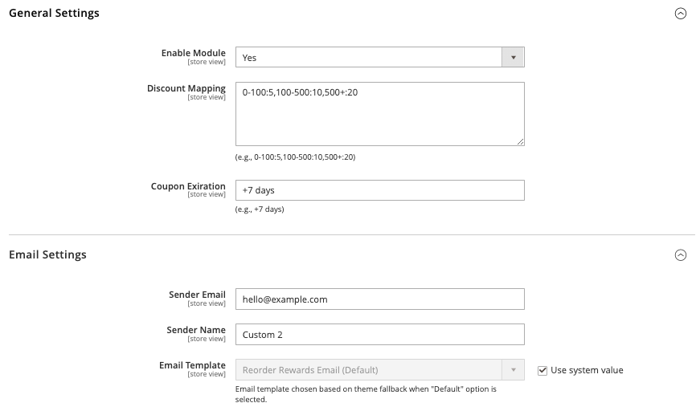
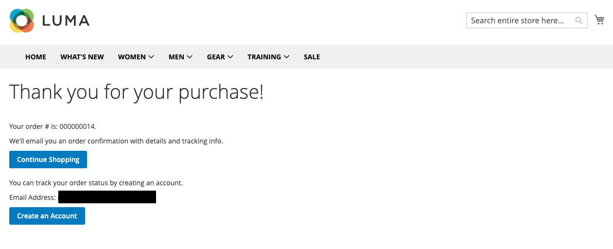
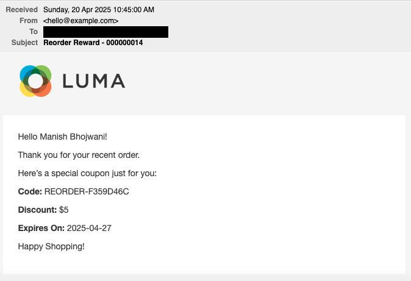
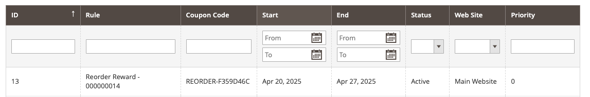
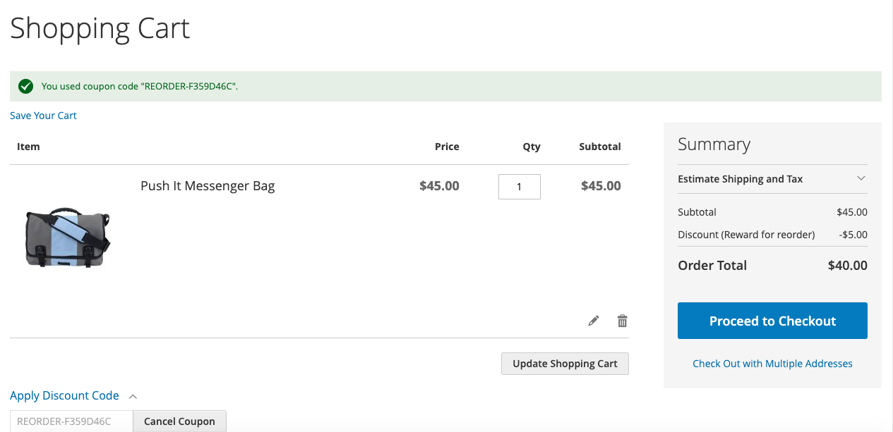

<strong>Mdbhojwani_ReorderRewards</strong> 

## Table of contents

- [Summary](#summary)
- [Installation](#installation)
- [Configurations](#configurations)
- [License](#license)

## Summary

The module is used to create coupon-based sale rule for customer based on their previous orders order-total amount and send same created sale rule details to them via email.

## Installation

```
composer require mdbhojwani/magento2-reorder-rewards
bin/magento module:enable Mdbhojwani_ReorderRewards
bin/magento setup:upgrade
bin/magento setup:di:compile
bin/magento setup:static-content:deploy -f
bin/magento cache:clean
bin/magento cache:flush
```

## Configurations

```
1. Login to Magento Backend
2. Navigate to Store > Configurations > Sales > Reorder Rewards
3. Enable the Module and update the configurations
```
- Module Configuration Screen


<br />
- Order Success Screen


<br />
- Reorder Rewards Email Screen


<br />
- Admin Sales Order Created Rule Screen


<br />
- Storefront Sales Rule applied on Cart Page Screen




## License

[Open Software License ("OSL") v. 3.0](https://opensource.org/license/osl-3-0-php)
